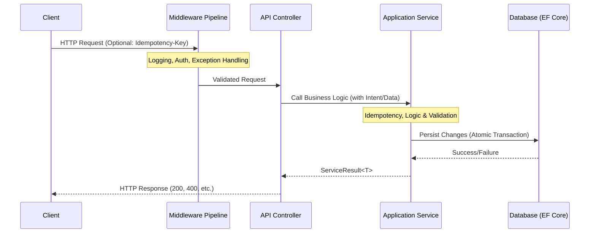

# Request Flow Documentation

This document explains how requests flow through the ITS-Hackthon Backend, covering various architectural patterns used for authentication, idempotent data modification, and financial transactions.

## High-Level Pipeline

The request pipeline is designed to be lean, with core logic residing in the Application and Service layers. **Idempotency is treated as a first-class backend responsibility.**

---

## Processing Layers

### 1. Middleware Pipeline (`Program.cs`)

Handles global, cross-cutting concerns:

- **GlobalExceptionHandler**: Standardizes error responses using `ProblemDetails`.
- **RequestTimingHandler**: Custom middleware to monitor latency.
- **Authentication**: Validates JWTs using `JwtBearer`.
- **Authorization**: Enforces policies and roles.
- **Rate Limiting**: Applied at the controller level via attributes (Policies: `LoginLimmter`, `Account`).

### 2. API Controllers (`API/Controller`)

- **Direct Handling**: Controllers act as the entry point, extracting user context (like `UserId` and `Role`) and passing it to services.
- **Result Mapping**: Maps `ServiceResult` objects to HTTP status codes.
- **Idempotency Guard**:
  - **Filter-Based**: Certain endpoints use `[TypeFilter(typeof(IdempotentAttribute))]` (e.g., Deposit/Withdraw) to process the `Idempotency-Key` header.
  - **Logic-Based**: Other endpoints (Transfers) handle idempotency through service-layer logic.

### 3. Application Services (`Application/Services`)

The core layer where **Idempotency** and **Business Logic** are unified:

- **Idempotency**:
  - **Filter Metadata**: For Deposits/Withdrawals, the backend stores full response snapshots in `IdempotencyRecords`.
  - **State/Intent Logic**: For Transfers, the backend tracks the lifecycle of `TransferIntents`.
- **Validation**: Ensures data integrity using `FluentValidation`.
- **Atomic Transactions**: Uses EF Core Transactions (`BeginTransactionAsync`) for multi-entity updates.

### 4. Infrastructure Layer (`Infrastructure/Persistence`)

- **EF Core**: Persistent storage via `BankDbContext`.
- **Auditing**: Automatically tracks `CreatedAt` and `CreatedBy` on all entities.

---

## Specific Request Flows

### 1. Authentication Flow (`AuthController`)

*Endpoints: `/login`, `/register`, `/refresh`*

1. **Request**: Client sends credentials.
2. **Rate Limiting**: `LoginLimmter` policy applied.
3. **AuthService**:
   - Validates user existence and password hash.
   - Generates JWT and Refresh Token.
   - Stores Refresh Token in DB.
4. **Response**: Tokens returned to the client.

### 2. Account Approval Flow (`AccountApprovalController`)

*Endpoints: `/request`, `/admin/pending`, `/admin/decide`*

1. **Context**: `UserId` extracted from JWT.
2. **Role Check**: Admin endpoints verify the `Admin` role from claims.
3. **ApprovalService**:
   - Handles file upload logic (ID documents).
   - Creates `AccountApprovalRequest` entity.
   - Updates `Account status` upon admin decision.
4. **Response**: Status update confirmation.

### 3. Transaction Flow (`AccountController` & `TransferController`)

*Endpoints: `/deposit`, `/withdraw`, `/intent`, `/complete`*

The system uses **Backend-Driven Idempotency** via two distinct patterns:

#### A. Filter-Based Idempotency (Deposit/Withdraw)

1. **Client** sends `Idempotency-Key` header.
2. **IdempotentAttribute Filter**:
   - **Lookup**: Checks `IdempotencyRecords` table for a match (Key + UserId).
   - **Hit**: If key exists, returns the cached `ResponseBody` and `StatusCode` immediately.
   - **Miss**: Allows execution. Upon success, stores the result in `IdempotencyRecords` before returning.
3. **AccountService**: Executes balance update and creates `Transaction` record.

#### B. Intent-Based Idempotency (Transfers)

1. **Phase 1 (Intent)**: Client requests a transfer intent. `TransferService` creates a `TransferIntents` record in `Pending` state.
2. **Phase 2 (Completion)**: Client sends `CompleteTransferDto` with `TransferIntentId`.
3. **Service Logic (Backend Guard)**:
   - Checks if `TransferIntent` exists and is still `Pending`.
   - If `Completed`, the backend recognizes the replay and returns the cached success without re-applying the transfer.
   - If `Pending`, executes atomic balance swap and transaction logging.
4. **Response**: Final account state.

---

### 4. Reporting & Export (`TransactionController`)

*Endpoints: `/download-transactions`*

1. **Context**: Verifies user access.
2. **TransactionExportService**:
   - Fetching transaction history with date filters.
   - Converting data to CSV format using `CSVService`.
3. **Response**: `FileStreamResult` (text/csv).
