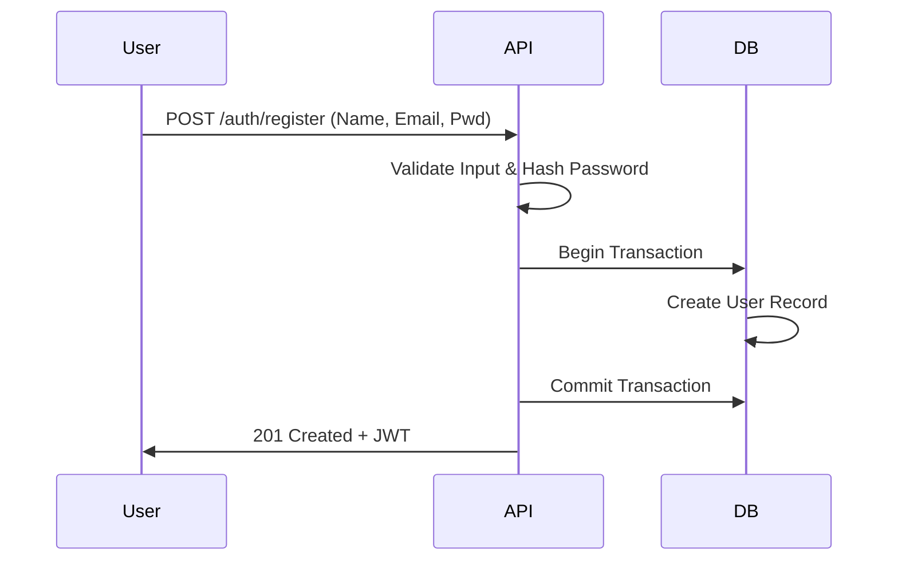
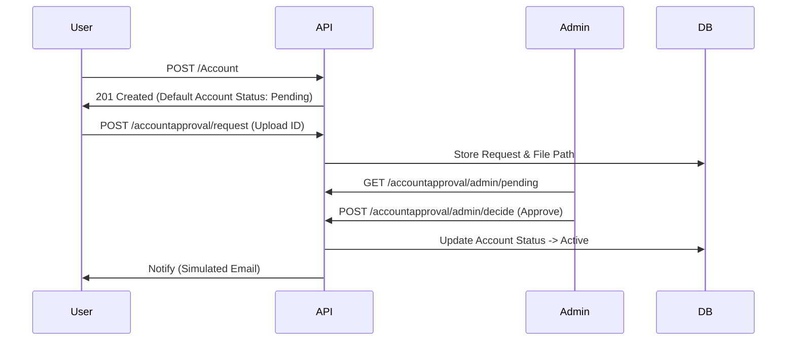
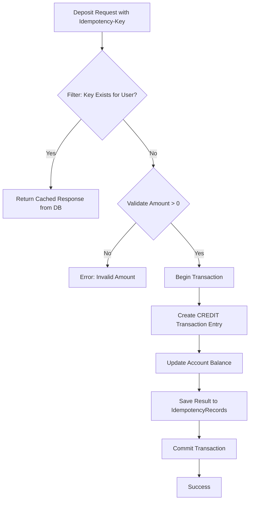
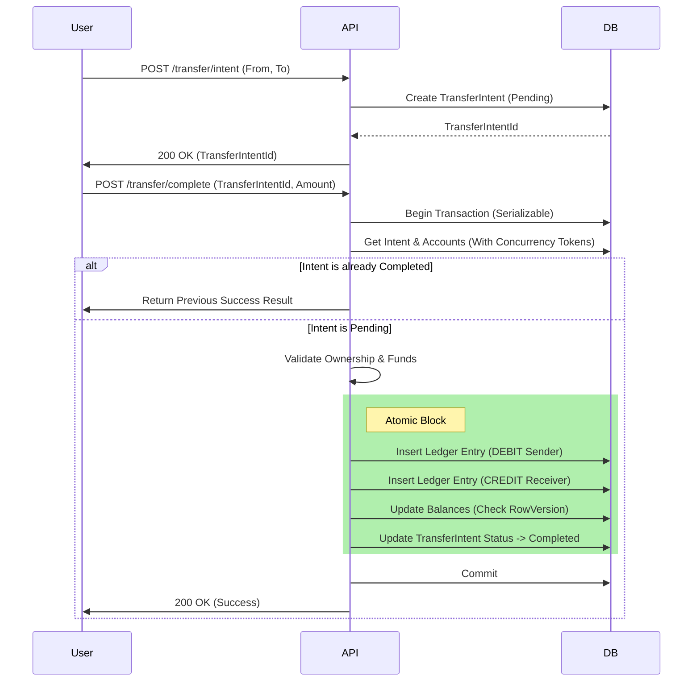

# SecureBank System Workflow

This document outlines the operational flow of the SecureBank system, from user onboarding to complex atomic transfers.

## 1. User Onboarding Flow

The system follows a "Zero-Friction" onboarding process where a default account is provisioned immediately upon registration.

---

### 1.5 Enhanced KYC Flow (Identity Verification)

To meet compliance standards, the system supports a "Pending" state for new accounts pending Admin Approval.

---

## 2. Core Ledger Mechanics

SecureBank uses a **pure ledger-based system**. Every change in balance is driven by a ledger entry (Debit or Credit).

### 2.1 Deposit Operation (Backend-Managed Idempotency)

The backend handles idempotency for deposits using the `Idempotency-Key` header and a specialized filter.

### 2.2 Withdrawal Operation (Backend-Managed Idempotency)

Similar to Deposit, the backend uses the `IdempotentAttribute` filter to guard against duplicate withdrawals while ensuring sufficiency checks are performed within the atomic block.

---

## 3. The Atomic Transfer Flow

Transfers are the most critical operations. SecureBank uses **Intent-Based Idempotency** for transfers, managed entirely on the backend to ensure a robust two-phase completion.

### Operational Sequence

1. **Initiate (Intent)**: The client requests to start a transfer. The backend creates a `TransferIntent` in `Pending` state and returns a unique `TransferIntentId`. This ID serves as the idempotency anchor.
2. **Complete (Two-Phase Completion)**: The client sends the `TransferIntentId` and `Amount` to the completion endpoint.
3. **Backend Validation**: The backend verifies:
    * The intent exists and is still `Pending`.
    * The authenticated user owns the source account.
    * Sufficient funds are available.
4. **Execution (Atomic Block)**:
    * **Debit Sender**: Create a `Debit` transaction for Account A.
    * **Credit Receiver**: Create a `Credit` transaction for Account B.
    * **Status Update**: Mark `TransferIntent` as `Completed`.
    * **Optimistic Locking**: Uses `RowVersion` to prevent double-spending during race conditions.
5. **Idempotency Guarantee**: If the completion request is replayed, the backend sees the intent status as `Completed` and returns the previous success without re-executing the money movement.

---

## 4. Integrity Guardrails

| Mechanism | Purpose |
| :--- | :--- |
| **RowVersion** | Prevents race conditions where two simultaneous $100 transfers from a $100 balance could both succeed. |
| **Atomic Transactions** | Ensures that it is impossible for money to leave the sender without arriving at the receiver. |
| **Immutable Ledger** | Transactions are append-only. No one (not even an admin) can "edit" history; they must file a corrective transaction. |
| **Backend Idempotency** | Prevents duplicate processing via `IdempotencyRecords` (Filter) or `TransferIntents` (Logic). |
| **ReferenceId** | Enables full auditability by linking the source and destination side of every movement. |

---

## 5. Background Workflows (Interest)

To simulate a real banking environment, a background job runs periodically.

* **Trigger**: `AccountInterestJob` (HostedService) runs every 2 minutes.
* **Action**:
    1. Scan all Active Savings Accounts.
    2. Calculate 0.01% Interest.
    3. Create `Credit` Transaction.
    4. Update Balance Atomically.
    5. Handle concurrency via Optimistic Locking (Skip on conflict).
