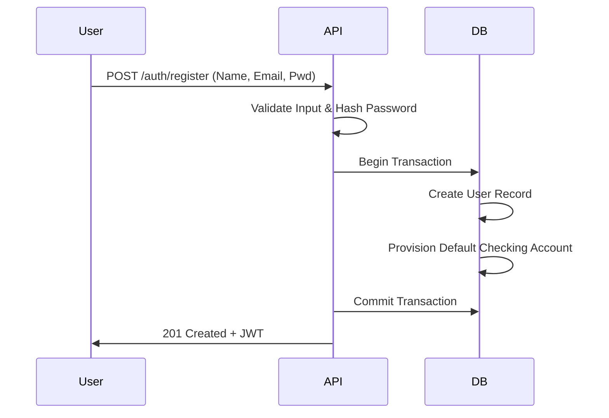
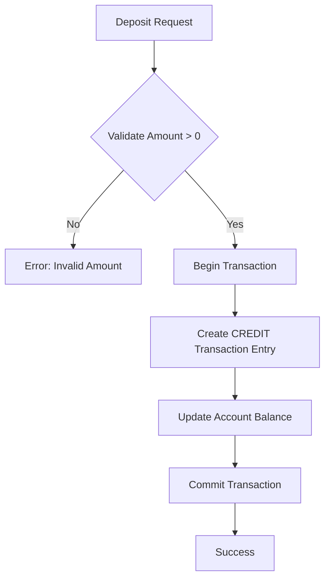
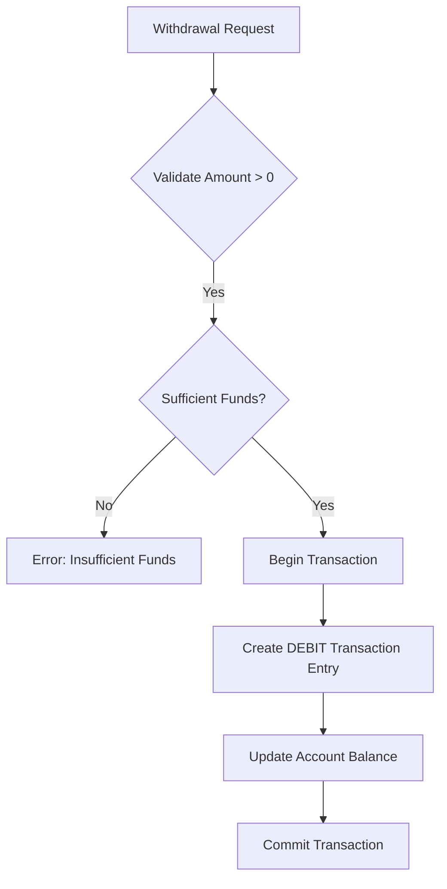
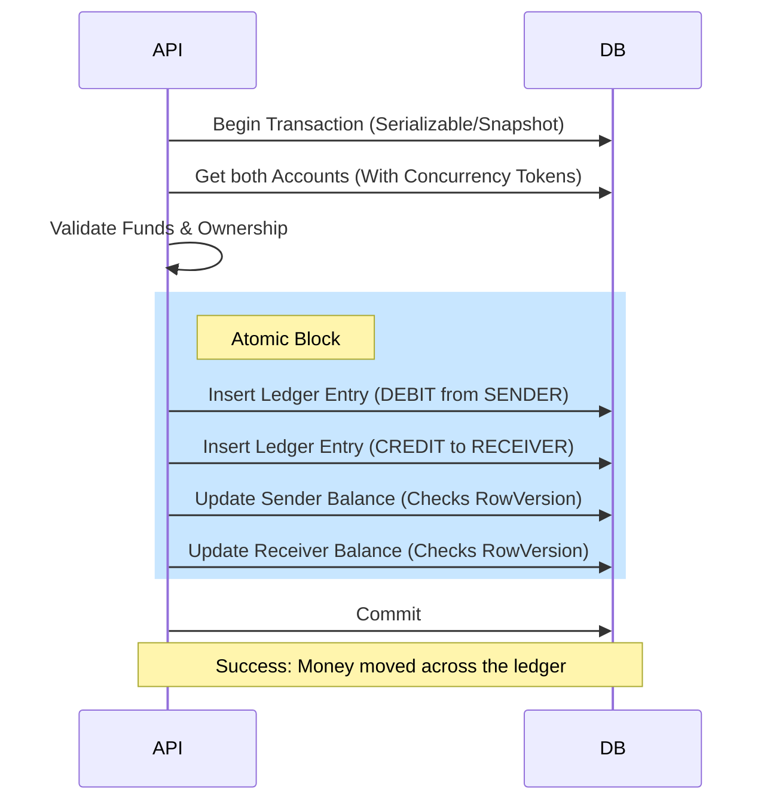

# SecureBank System Workflow

This document outlines the operational flow of the SecureBank system, from user onboarding to complex atomic transfers.

## 1. User Onboarding Flow
The system follows a "Zero-Friction" onboarding process where a default account is provisioned immediately upon registration.

---

## 2. Core Ledger Mechanics
SecureBank uses a **pure ledger-based system**. Every change in balance is driven by a ledger entry (Debit or Credit).

### 2.1 Deposit Operation

### 2.2 Withdrawal Operation

---

## 3. The Atomic Transfer Flow
Transfers are the most critical operations. They must be atomic (all-or-nothing) and concurrency-safe.

### Operational Sequence:
1.  **Authorization**: Verify the authenticated user owns the `fromAccountId`.
2.  **Discovery**: Find the `toAccount` using the unique `AccountNumber`.
3.  **Validation**: Check `amount > 0` and `fromAccount.Balance >= amount`.
4.  **Locking**: The database transaction ensures that the balance read for validation remains consistent during the update phase.
5.  **Execution** (Atomic Block):
    *   **Debit Sender**: Create a `Debit` transaction for Account A.
    *   **Credit Receiver**: Create a `Credit` transaction for Account B.
    *   **Link**: Both transactions share the same `ReferenceId`.
    *   **Snapshot**: Record `BalanceAfter` on both ledger entries.
6.  **Concurrency Resolution**: If another request modified the balance in the same millisecond, the `RowVersion` check will trigger a rollback, preventing a "Double Spend".

---

## 4. Integrity Guardrails

| Mechanism | Purpose |
| :--- | :--- |
| **RowVersion** | Prevents race conditions where two simultaneous $100 transfers from a $100 balance could both succeed. |
| **Atomic Transactions** | Ensures that it is impossible for money to leave the sender without arriving at the receiver. |
| **Immutable Ledger** | Transactions are append-only. No one (not even an admin) can "edit" history; they must file a corrective transaction. |
| **ReferenceId** | Enables full auditability by linking the source and destination side of every movement. |
| **Balance Reconciliation** | The system allows an auditor to sum all ledger entries for an account to verify the current balance matches exactly. |
