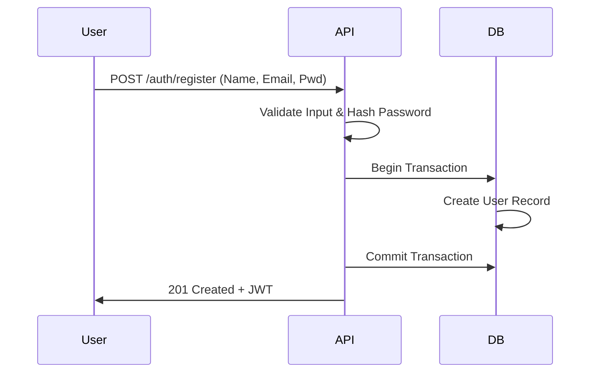
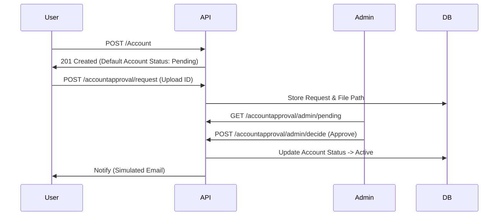
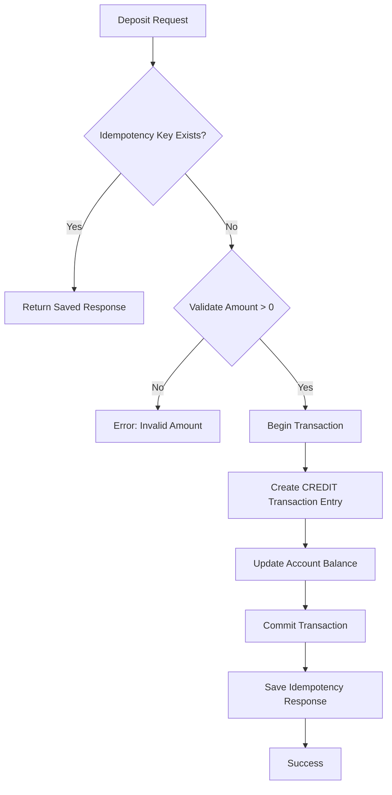
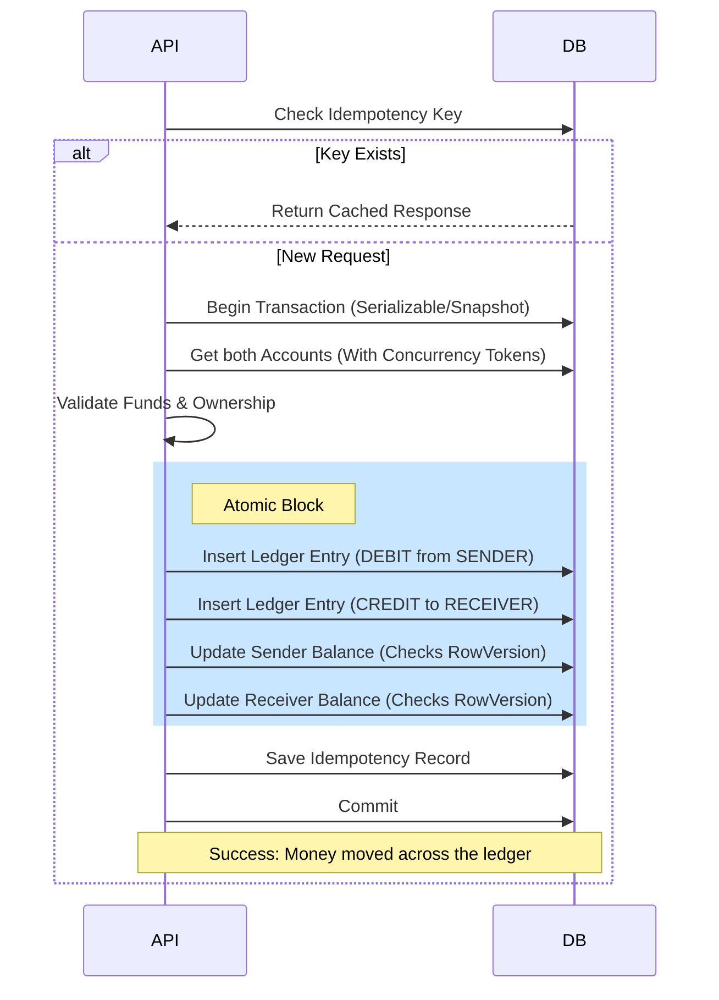

# SecureBank System Workflow

This document outlines the operational flow of the SecureBank system, from user onboarding to complex atomic transfers.

## 1. User Onboarding Flow

The system follows a "Zero-Friction" onboarding process where a default account is provisioned immediately upon registration.

---

### 1.5 Enhanced KYC Flow (Identity Verification)

To meet compliance standards, the system supports a "Pending" state for new accounts pending Admin Approval.

---

## 2. Core Ledger Mechanics

SecureBank uses a **pure ledger-based system**. Every change in balance is driven by a ledger entry (Debit or Credit).

### 2.1 Deposit Operation (Idempotent)

### 2.2 Withdrawal Operation (Idempotent)

Similar to Deposit, with sufficiency checks + Idempotency Guard.

---

## 3. The Atomic Transfer Flow

Transfers are the most critical operations. They must be atomic (all-or-nothing) and concurrency-safe.

### Operational Sequence

1. **Idempotency Check**: Return cached result if key exists.
2. **Authorization**: Verify the authenticated user owns the account associated with `fromAccountNumber`.
3. **Discovery**: Find the `toAccount` using the unique `AccountNumber`.
4. **Validation**: Check `amount > 0` and `fromAccount.Balance >= amount`.
5. **Locking**: The database transaction ensures that the balance read for validation remains consistent during the update phase.
6. **Execution** (Atomic Block):
    * **Debit Sender**: Create a `Debit` transaction for Account A.
    * **Credit Receiver**: Create a `Credit` transaction for Account B.
    * **Link**: Both transactions share the same `ReferenceId`.
    * **Snapshot**: Record `BalanceAfter` on both ledger entries.
7. **Concurrency Resolution**: If another request modified the balance in the same millisecond, the `RowVersion` check will trigger a rollback, preventing a "Double Spend".

---

## 4. Integrity Guardrails

| Mechanism | Purpose |
| :--- | :--- |
| **RowVersion** | Prevents race conditions where two simultaneous $100 transfers from a $100 balance could both succeed. |
| **Atomic Transactions** | Ensures that it is impossible for money to leave the sender without arriving at the receiver. |
| **Immutable Ledger** | Transactions are append-only. No one (not even an admin) can "edit" history; they must file a corrective transaction. |
| **ReferenceId** | Enables full auditability by linking the source and destination side of every movement. |
| **Idempotency Keys** | Prevents duplicate processing of the same request due to network retries. |

---

## 5. Background Workflows (Interest)

To simulate a real banking environment, a background job runs periodically.

* **Trigger**: `AccountInterestJob` (HostedService) runs every 2 minutes.
* **Action**:
    1. Scan all Active Savings Accounts.
    2. Calculate 0.01% Interest.
    3. Create `Credit` Transaction.
    4. Update Balance Atomically.
    5. Handle concurrency via Optimistic Locking (Skip on conflict).
